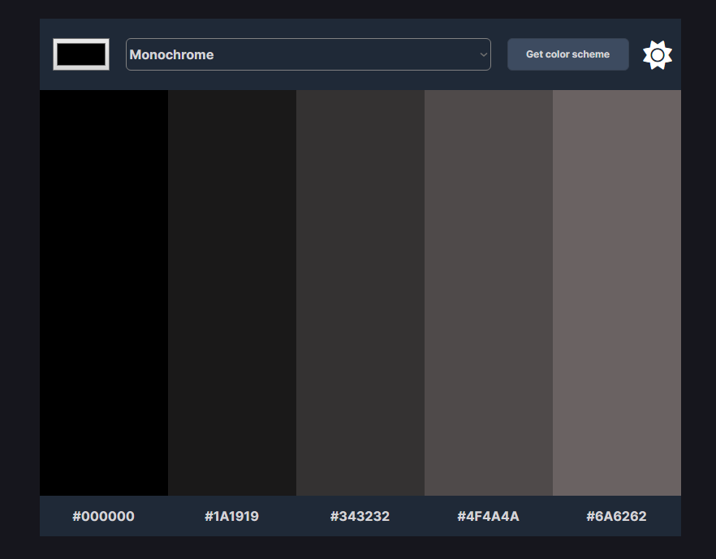
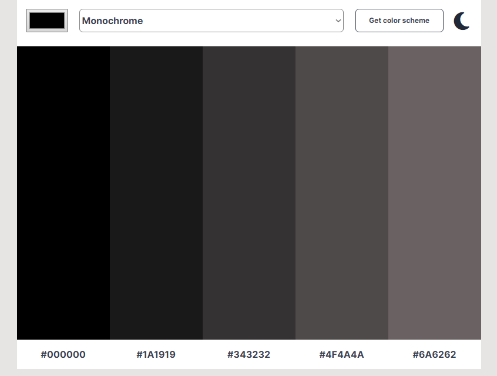
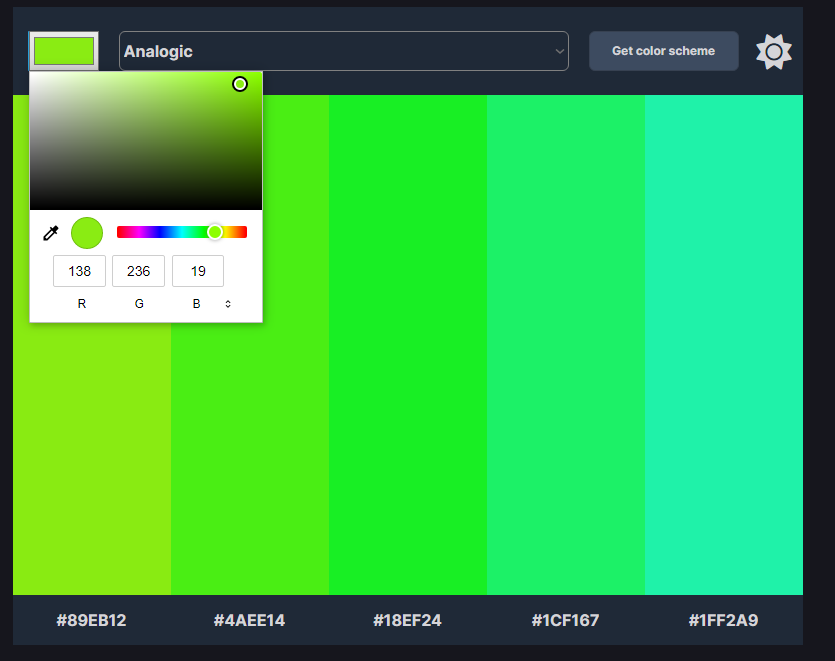
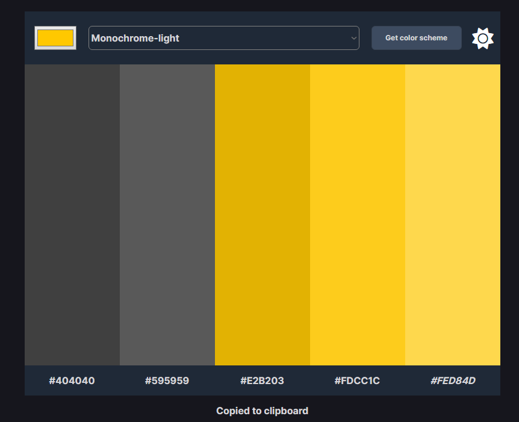

#  Color Scheme Generator Project

Color Scheme Generator Project from [Scrimba](https://scrimba.com/learn/frontend)'s Working With APIs module.

## Project Link

[Project Link]  Hosted using Netlify 

## Previews

Color Generator (Dark Mode)

Color Generator (Light Mode)

Color Selector

Copied To Clipboard

## Project Functionality

- Generates a color schreme using the The Color API.
- Allows the user to select a color and a color scheme mode to generate a color schreme.
- Hex values are copied to clipboard when clicked on.
- User can switch from dark mode and light mode
